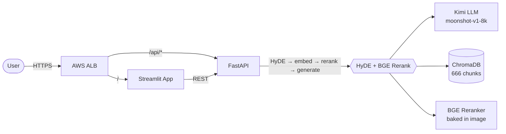

# Master Guo Lai's Fortune Hall — Chinese Divination RAG


A production-deployed RAG system over three classical Chinese divination texts (《三命通会》《滴天髓》《子平真诠》), built end-to-end:

- **Retrieval research** — 9 strategies × 28 configurations, evaluated by GPT-4o with Chinese eval embeddings
- **Full-stack app** — FastAPI + Streamlit + ChromaDB, history-aware HyDE + BGE Rerank pipeline
- **Production deployment** — AWS ECS / ALB / Terraform, GitHub Actions CI/CD, with 5 real incidents documented and resolved

> 📑 In-depth docs: [Architecture](docs/ARCHITECTURE.md) · [Retrieval Benchmark](docs/BENCHMARK_REPORT.md) · [Deployment Notes](docs/DEPLOYMENT_NOTES.md)

---

## Architecture at a Glance



The production retrieval pipeline (per request):

1. LLM writes a *hypothetical* classical-Chinese passage in answer style — **HyDE**
2. Embed the hypothetical, similarity-search **k=8** candidates against ChromaDB
3. BGE cross-encoder re-scores each candidate against the **original** question, keep **top 5**
4. Stuff top 5 chunks into a role-prompted QA template, generate via Kimi

Full diagram and per-decision rationale → [docs/ARCHITECTURE.md](docs/ARCHITECTURE.md).

---

## Quick Start

Prerequisites: Docker + Docker Compose, a [Kimi (Moonshot) API key](https://platform.moonshot.cn).

```bash
git clone https://github.com/Yanko96/Chinese-Fortune-Telling.git
cd Chinese-Fortune-Telling

# Configure secrets
cp .env.example .env
# Edit .env: set MOONSHOT_API_KEY=sk-...

# Build vector index from the PDFs in fortune_books/ (one-time, ~3 min)
python scripts/build_index_bge.py --output-dir ./chroma_db_bge

# Launch the full stack
docker-compose up --build
```

Open <http://localhost:8501> in a browser.

For a manual (non-Docker) setup, see [docs/ARCHITECTURE.md §Quick Local Run](docs/ARCHITECTURE.md).

---

## What's in this repo

### 1. Retrieval Research

A systematic benchmark comparing **9 retrieval strategies** across two evaluation dimensions, totaling **28 experiment configurations**.

| Dataset | Questions | Scope | Evaluation |
|---|:-:|---|---|
| `qa_dataset.json` (Normal) | 22 | Single-book, single-hop | RAGAS 4 metrics — faithfulness, relevancy, recall, precision |
| `qa_multihop.json` (Multihop) | 36 | Cross-book, 3-step reasoning | LLM `chain_score` (per-step 0 / 0.5 / 1) |

**Top results** (highlights — full tables in [BENCHMARK_REPORT.md](docs/BENCHMARK_REPORT.md)):

| Task | Winner | Score | Why it wins |
|---|---|---|---|
| Normal (22Q AVG) | **HyDE + Rerank** | **0.812** | Faithfulness 0.917; hypothesis-conditioned retrieval beats keyword/dense alone |
| Multihop (36Q chain) | **Graph RAG v7** (`vector_filter_k=50`) | **0.729** | Semantic gate on graph neighbors solves cross-book reasoning |
| Cross-book hit | Graph RAG v8 (k=20) | **91.7%** | IDF-weighted edges bridge concepts across《三命通会》/《滴天髓》/《子平真诠》 |

**Method evolution** (Graph RAG):

```
v1  flat graph (43K edges)             noisy, low precision
v2  pruned (min_weight=2, 15K edges)   +3pp
v3  IDF-weighted + degree-pruned (5K)  discriminative connections
v4  reranker upgrade                   marginal
v5  HyDE seed generation               better q↔doc matching
v6  max_neighbors ablation (30→10)     noise reduction trade-off
v7  vector_filter_k (semantic gate)    ★ best multihop (0.729)
v8  bge-base-zh (768d) + k=15          ★ best normal-graph (0.804)
```

### 2. System Design

- `api/` — FastAPI, history-aware retrieval chain via LangChain, lazy-loaded ChromaDB + BGE
- `app/` — Streamlit UI: BaZi birth-date picker, zodiac selector, chat history
- `scripts/` — Reproducible offline tools: index build, knowledge-graph build, full benchmark sweep, GPT-4o rescoring
- `terraform/` — Modular IaC: vpc / alb / ecs / ecr, separate `environments/production` workspace

Key design decisions and the trade-offs behind them → [docs/ARCHITECTURE.md](docs/ARCHITECTURE.md).

### 3. Production Deployment

CI/CD pipeline (`.github/workflows/deploy.yml`):

```
push to main → GitHub Actions
              ├── docker build api + app (commit-SHA tagged)
              ├── push to ECR
              └── terraform apply (force_new_deployment=true)
                  → ECS rolls new tasks → ALB picks them up
```

Required GitHub Secrets:

| Secret | Used for |
|---|---|
| `AWS_ACCESS_KEY_ID`, `AWS_SECRET_ACCESS_KEY` | ECR push, Terraform (S3 backend, DynamoDB lock, ECS, ECR, ALB, VPC, CloudWatch) |
| `MOONSHOT_API_KEY` | Passed by Terraform into the API container at deploy time |

After a successful deploy, the ALB DNS is printed to the GitHub Actions Job Summary.

**Five production incidents documented** — Gemini key expiry → Kimi migration, rolling-deploy enum mismatch, leftover `.value` calls, BGE reranker OOM, ALB 504 timeout — each with root cause and resolution in [docs/DEPLOYMENT_NOTES.md](docs/DEPLOYMENT_NOTES.md).

### 4. Evaluation Methodology

Two non-trivial methodology choices, each measurably moving the leaderboard:

| Choice | What | Why it matters |
|---|---|---|
| **GPT-4o as judge** (not Kimi self-eval) | All RAGAS scores re-run via GPT-4o | Kimi-judging-Kimi was 10–33% more lenient than GPT-4o on the same 22Q set — a real self-evaluation bias |
| **Chinese eval embedding** (bge-small-zh-v1.5, not `all-MiniLM-L6-v2`) | Used for `answer_relevancy` cosine similarity | Boosted answer_relevancy by **+12.5pp** — English embeddings undercount Chinese semantic overlap |

Custom `chain_score` metric for multihop: each reasoning step scored 0 / 0.5 / 1 against the gold answer, then averaged across all hops in the chain. See [BENCHMARK_REPORT.md §7](docs/BENCHMARK_REPORT.md) for the rubric and inter-annotator-style calibration runs.

---

## Knowledge Graph (offline; powers Graph RAG)

- **668 nodes** — 419 from 《三命通会》, 154 from 《滴天髓》, 95 from 《子平真诠》
- **5,255 IDF-weighted edges** — cross-book only, degree-pruned to ≤15 neighbors per node
- **41 bridge terms** — 官星 / 财星 / 印绶 / 用神 etc., connecting concepts across the three texts
- Edge-weight range 3.0–16.5 (higher weight = rarer shared term = stronger connection)

Built via:

```bash
python scripts/build_knowledge_graph.py --chroma-dir ./chroma_db_bge --min-weight 2
```

---

## Reproducing the Benchmark

```bash
# Normal benchmark (22Q, RAGAS, GPT-4o judge)
python scripts/rag_bench.py \
    --configs configs/rag/v5/hyde_rerank_topn7.yaml \
    --dataset benchmarks/qa_dataset.json \
    --output-dir benchmarks/results/my_run \
    --eval-provider openai --eval-model gpt-4o

# Multihop benchmark (36Q, chain_score)
python scripts/bench_multihop.py \
    --configs configs/rag/v8/graph_rag_v7_vf50.yaml \
    --dataset benchmarks/qa_multihop.json \
    --no-parallel

# Rescore stored results with GPT-4o
python scripts/rescore_gpt4o.py             # multihop
python scripts/rescore_normal_gpt4o.py      # normal
```

---

## Known Limitations

- **Production-vs-benchmark eval gap (measured + partially closed).** Offline benchmark uses pure Chinese questions; production prepends `"BaZi analysis for someone born on {date}, gender: {sex}. "`, which pollutes HyDE. A 10-pair controlled shadow eval ([Appendix A](docs/BENCHMARK_REPORT.md#附录-aproduction-shadow-eval)) measured the raw gap at **Δ = −0.5** (3.0 vs. 3.5 / 5). A `_strip_query_prefix` fix (`api/fortune_langchain_utils.py`) cut the gap to **Δ = −0.3 (40% closure)**; the residual is consistent with HyDE's `temperature=0.7` stochasticity at this sample size. A larger fixed-dataset + deterministic re-run is on the roadmap for a p<0.05 confirmation.
- **Single-region, single-AZ deploy.** Production runs in `us-east-1` only. Adding a second AZ in the ALB target group is a 1-line Terraform change; a second region needs cross-region ECR replication and would change the Terraform layout.
- **No streaming responses.** The rerank step is the latency dominator, not the LLM output — streaming would add complexity without UX improvement here.

---

## Tech Stack

| Layer | Choice |
|---|---|
| Backend | FastAPI · LangChain (`langchain-openai`, `langchain-classic`) |
| Frontend | Streamlit |
| Vector DB | ChromaDB (file-backed) |
| Embeddings | `BAAI/bge-small-zh-v1.5` (prod) · `bge-base-zh-v1.5` (Graph RAG offline) |
| Reranker | `BAAI/bge-reranker-base` (cross-encoder) |
| LLM | Kimi (Moonshot) `moonshot-v1-8k` / `-32k` / `-128k` via OpenAI-compatible API |
| Eval | RAGAS · GPT-4o judge · Chinese eval embeddings |
| Infra | AWS ECS Fargate · ALB · ECR · Terraform · GitHub Actions |

---

## License

MIT — see [LICENSE](LICENSE).

## Acknowledgments

- Source texts are public-domain classical Chinese divination works.
- All readings produced by this system are for demonstration and entertainment.
