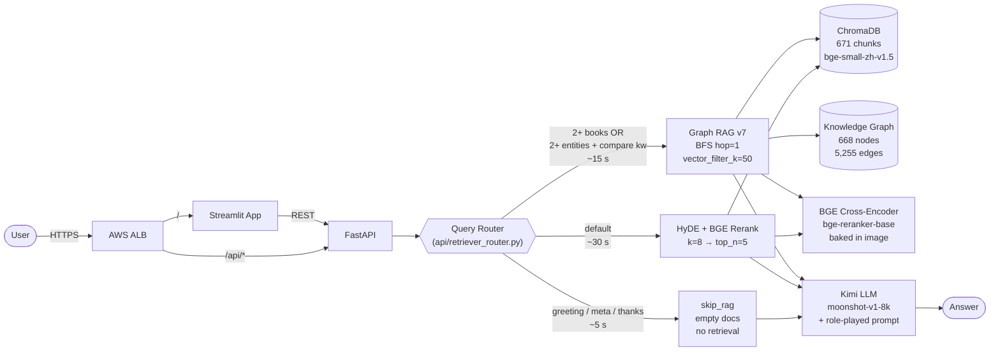

# Master Guo Lai's Fortune Hall — Chinese Divination RAG


## 🌐 Live Demo

**[http://fortune-teller-alb-1669179181.us-east-1.elb.amazonaws.com/](http://fortune-teller-alb-1669179181.us-east-1.elb.amazonaws.com/)**

Running on AWS ECS Fargate behind an ALB (`us-east-1`). Try `你好` for a sub-5s skip-RAG greeting, or set a birthday in the sidebar + ask `什么是正财格？` for a full HyDE+Rerank BaZi reading (~30 s).

> **Note**: Backed by a shared Kimi (Moonshot) API key with a finite daily quota. If you see a `503 — upstream LLM is temporarily overloaded` message, the rate limit is hit; retry in a few seconds. Health: [`/api/healthz`](http://fortune-teller-alb-1669179181.us-east-1.elb.amazonaws.com/api/healthz)

---

A production-deployed RAG system over three classical Chinese divination texts (《三命通会》《滴天髓》《子平真诠》), built end-to-end:

- **Retrieval research** — 9 strategies × 28 configurations, evaluated by GPT-4o with Chinese eval embeddings
- **Full-stack app** — FastAPI + Streamlit + ChromaDB, history-aware retrieval chain with a query router dispatching to skip-RAG / HyDE+Rerank / Graph RAG per request
- **Production deployment** — AWS ECS / ALB / Terraform, GitHub Actions CI/CD, with 5 real incidents documented and resolved

> 📑 In-depth docs: [Architecture](docs/ARCHITECTURE.md) · [Retrieval Benchmark](docs/BENCHMARK_REPORT.md) · [Deployment Notes](docs/DEPLOYMENT_NOTES.md)

---

## Architecture at a Glance

> **Production retrieval is router-dispatched**: HyDE + BGE Rerank by default (`k=8 → top_n=5`, single-hop winner AVG=0.812), with Graph RAG v7 (`vector_filter_k=50`, multihop winner chain_score=0.729) invoked when a heuristic query classifier detects high-confidence cross-book / multihop intent, and a skip-RAG fast path for greetings / meta / thanks.
> See [§1a HyDE+Rerank](#1a-hyde--bge-rerank--production-default), [§1b Graph RAG](#1b-graph-rag--multihop-specialist), [§1c Query Router](#1c-query-router--picks-hyde-vs-graph-per-request).



Per-request flow:

When a request hits `/api/fortune`, the FastAPI handler first checks the raw user question against `should_skip_rag()` — if it's a greeting/meta/thanks, it downgrades `query_type` from BaZi/Forecast to GENERAL regardless of the frontend's choice (so a user typing `你好` with a birthday selected doesn't get hit with a forced four-pillar calculation). Then it builds a routed retrieval chain that dispatches one of three pipelines per query:

| Branch | Triggers when | Pipeline | p50 latency |
|---|---|---|:-:|
| **skip_rag** | greeting / meta / thanks — anchored regex on `你好`/`hi`/`你能做什么`/`谢谢`/… | Empty docs → role-played QA prompt → Kimi | **~5 s** |
| **HyDE + Rerank** (default) | Single-hop substantive questions | Kimi writes classical-Chinese hypothetical → embed via `bge-small-zh-v1.5` → ChromaDB **k=8** → BGE cross-encoder rerank against the **original** question (catches lexical matches dense embedding smooths over) → **top 5** → QA prompt → Kimi | ~30 s |
| **Graph RAG v7** | 2+ books mentioned (`《X》《Y》`) **OR** 2+ bridge terms + compare keyword | ChromaDB k=8 seeds → BFS over knowledge graph (hop=1, cross-book only) → `vector_filter_k=50` semantic whitelist → BGE rerank → top 5 → QA prompt → Kimi | ~15 s |

The HyDE and Graph branches both share Chroma + BGE; only Graph additionally consults the knowledge graph. Skip-RAG bypasses retrieval entirely — the LLM persona prompt handles greetings on its own. Per-decision design rationale for each branch is in §1a / §1b / §1c below. The full latency budget that drove `k=15→8 / top_n=7→5` on the HyDE path is in [docs/DEPLOYMENT_NOTES.md §5](docs/DEPLOYMENT_NOTES.md).

Full diagram and per-decision rationale → [docs/ARCHITECTURE.md](docs/ARCHITECTURE.md).

---

## Quick Start

> Just want to poke at the system? The [live demo](http://fortune-teller-alb-1669179181.us-east-1.elb.amazonaws.com/) is the same code as `main`, deployed via the `deploy.yml` workflow. The instructions below are for running locally.

Prerequisites: Docker + Docker Compose, a [Kimi (Moonshot) API key](https://platform.moonshot.cn).

```bash
git clone https://github.com/Yanko96/Chinese-Fortune-Telling.git
cd Chinese-Fortune-Telling

# Configure secrets
cp .env.example .env
# Edit .env: set MOONSHOT_API_KEY=sk-...

# Launch the full stack (Dockerfile builds the vector index from
# fortune_books/ at image build time — no separate setup step)
docker-compose up --build
```

Open <http://localhost:8501> in a browser. Health check at <http://localhost:8000/api/healthz>.

For a manual (non-Docker) setup, see [docs/ARCHITECTURE.md](docs/ARCHITECTURE.md).

---

## What's in this repo

### 1. Retrieval Research

A systematic benchmark comparing **9 retrieval strategies** across two evaluation dimensions, totaling **28 experiment configurations**. Two methods are documented in depth below: **HyDE + BGE Rerank** (deployed to production) and **Graph RAG** (offline research, multihop winner).

| Dataset | Questions | Scope | Evaluation |
|---|:-:|---|---|
| `qa_dataset.json` (Normal) | 22 | Single-book, single-hop | RAGAS 4 metrics — faithfulness, relevancy, recall, precision |
| `qa_multihop.json` (Multihop) | 36 | Cross-book, 3-step reasoning | LLM `chain_score` (per-step 0 / 0.5 / 1) |

**Top results** (highlights — full tables in [BENCHMARK_REPORT.md](docs/BENCHMARK_REPORT.md)):

| Task | Winner | Score | Why it wins | Production role |
|---|---|---|---|---|
| Normal (22Q AVG) | **HyDE + Rerank** | **0.812** | Faithfulness 0.917; hypothesis-conditioned retrieval beats keyword/dense alone | ✅ Default branch (most queries) |
| Multihop (36Q chain) | **Graph RAG v7** (`vector_filter_k=50`) | **0.729** | Semantic gate on graph neighbors solves cross-book reasoning | ✅ Router-dispatched (multihop queries) |
| Cross-book hit | Graph RAG v8 (k=20) | **91.7%** | IDF-weighted edges bridge concepts across《三命通会》/《滴天髓》/《子平真诠》 | 🔬 Offline (k=15 in router) |

#### 1a. HyDE + BGE Rerank — production default

The default branch of the router. Wins single-hop (AVG=0.812, faithfulness=0.917 on 22Q) and remains the highest-faithfulness method across the entire 28-config sweep — important for a system whose users read the answer as authoritative classical exegesis.

**Why HyDE here, specifically?**
Direct dense retrieval over Chinese classical text has a query↔document distribution gap: the user asks `"什么是正财格？"` in modern Chinese, but the answer chunks are in classical Chinese (`"正财者，乃甲见己、乙见戊之例。受我克制，为我之妻..."`). Embedding the question directly underweights the right chunks. HyDE closes the gap by asking the LLM to **write a classical-Chinese passage in the answering style first**, then embedding *that* — the retrieval seed now lives in the same distribution as the corpus.

```
Question (modern Chinese)
  └── HyDE prompt asks Kimi to write 80–150 char classical-style passage
        └── Embed hypothetical passage with bge-small-zh-v1.5 (384d)
              └── ChromaDB similarity search → 8 candidate chunks (wide recall)
                    └── BGE Cross-Encoder rerank against ORIGINAL question
                          └── Top 5 chunks → role-played QA prompt → Kimi answer
```

**Why rerank, on top of HyDE?**
HyDE expands recall but introduces noise — the LLM-written hypothetical sometimes drifts. The BGE cross-encoder is a different model class (not a dual-encoder); it scores `(query, chunk)` pairs **jointly**, which catches lexical/keyword matches that the dense step's bag-of-meaning embedding smooths over. The two errors are negatively correlated: HyDE-only loses on precision when hypothesis drifts; Rerank-only loses on recall when the surface form of the question doesn't match the canonical text. Stacked, faithfulness jumps from 0.755 (Hybrid+Rerank) to **0.917** (HyDE+Rerank).

**Ablation summary (full table in BENCHMARK_REPORT):**

| Config | Faithfulness | Relevancy | Recall | Precision | AVG |
|---|:-:|:-:|:-:|:-:|:-:|
| **HyDE + Rerank** (production) | **0.917** | 0.651 | 0.829 | 0.850 | **0.812** |
| Graph RAG v8 (bge-base, k=15) | 0.841 | 0.656 | 0.849 | 0.868 | 0.804 |
| Hybrid (BM25 + Vector) | 0.762 | 0.668 | 0.846 | 0.885 | 0.790 |
| Hybrid + BGE Rerank | 0.755 | 0.664 | 0.720 | 0.894 | 0.758 |
| Proposition (Vector) | 0.492 | 0.667 | 0.567 | 0.719 | 0.611 |

**Production-specific design notes:**

| Knob | Value | Why |
|---|---|---|
| `hyde_k` (wide recall) | 8 | Benchmark winner is k=15, but `k=8` is the p95 latency line for a 0.5 vCPU ECS task with 120s ALB timeout. Faithfulness loss vs k=15 is <2pp; latency improvement is 70s→30s. See [DEPLOYMENT_NOTES §5](docs/DEPLOYMENT_NOTES.md). |
| `top_n` (after rerank) | 5 | Reduced from 7 alongside `hyde_k` cut. Generation prompt fits comfortably under 32k context. |
| HyDE prompt language | 文言文 (classical Chinese) | Critical — modern Chinese hypotheticals match poorly with the corpus's classical phrasing. The prompt explicitly says "仿照古典命理文献的风格". |
| Rerank scoring text | original Chinese question | Reranking against the HyDE hypothetical would compound HyDE's noise. The cross-encoder is meant to **counter** the HyDE drift, not amplify it. |
| Prefix-strip before HyDE | regex strip of `"BaZi analysis for..."` wrapper | Production's BaZi/Forecast paths prepend an English query rewriter to the user's Chinese question, which polluted HyDE. Shadow eval measured −0.5 retrieval quality; the fix recovers most of it. Code at `api/fortune_langchain_utils.py:_strip_query_prefix`, tests at `tests/test_query_prefix_strip.py`. |

Code: [`api/fortune_langchain_utils.py`](api/fortune_langchain_utils.py) (130 lines, no abstractions — `_build_hyde_rerank_retriever` is the whole thing).

#### 1b. Graph RAG — multihop specialist

Routed-to when the query classifier (§1c) detects cross-book / multihop intent. Wins multihop (`chain_score=0.729`, cross-book hit 92%) by combining graph topology (IDF-weighted cross-book edges over a knowledge graph of 668 nodes) with the same vector retrieval + BGE rerank pipeline as the HyDE path.

**The key insight (v7):** combining graph topology with vector semantics beats either alone. Pure-vector retrieval misses the cross-book bridges (different classical texts use different terms for the same concept); pure-graph BFS expansion is noisy (high-degree concept nodes drown the signal). Adding `vector_filter_k` — gate graph neighbors through a top-50 vector recall whitelist — kept the topology benefit while preserving precision.

**8-version method evolution:**

```
v1  flat graph (min_weight=1, 43K edges)        → noisy, low precision baseline
v2  pruned (min_weight=2, 15K edges)            → +3pp from removing weak co-occurrences
v3  IDF-weighted edges + degree pruning (5K)    → discriminative connections, rare-term bridges weighted up
v4  reranker upgrade (bge-v2-m3) + top_n=10     → marginal: retrieval ceiling, not rerank ceiling
v5  HyDE-seeded graph entry                     → better q↔doc match at the seed node
v6  max_neighbors ablation (30→10)              → noise/recall trade-off
v7  vector_filter_k semantic gate               → ★ best multihop (0.729)
v8  bge-base-zh (768d) + k=15                   → ★ best normal-graph (0.804)
```

Why it's gated behind the router instead of replacing HyDE globally:

- **Single-hop loss**: most production traffic is single-hop ("explain my BaZi"). On those, HyDE+Rerank beats Graph (0.812 vs 0.804) AND is more faithful (0.917 vs 0.841)
- **Cold-start cost**: graph + chunk-index load is ~50 ms once, but only triggered on the first multihop route — lazy-loaded by the router so single-hop traffic never pays this cost
- **Operational synchronization**: graph topology has to stay in sync with the embedding index. Two artifacts to rebuild on corpus change vs. one. Per-route gating means only multihop queries are exposed to this drift risk

The router pattern lets us deploy both methods without forcing one to subsume the other.

**Knowledge graph stats:** 668 nodes (419 三命通会 / 154 滴天髓 / 95 子平真诠), 5,255 IDF-weighted cross-book edges (degree-pruned to ≤15 neighbors per node), 41 bridge terms (官星 / 财星 / 印绶 / 用神 …) connecting concepts across texts. Edge weights 3.0–16.5 — higher = rarer shared term = stronger conceptual bridge. Built via `python scripts/build_knowledge_graph.py --chroma-dir ./chroma_db_bge --min-weight 2`.

Code: [`api/graph_retriever.py`](api/graph_retriever.py). **Wired into production via the router below** — Graph RAG runs when the query classifier identifies a high-confidence multihop / cross-book pattern.

#### 1c. Query Router — picks HyDE vs. Graph per request

Neither method dominates the full query distribution: HyDE wins single-hop, Graph wins multihop. Rather than picking one globally, a lightweight heuristic router classifies each incoming query and dispatches to the better strategy.

**Policy — three branches, evaluated in order**:

```python
def _route(query):
    if should_skip_rag(query):           # greetings / meta / thanks -> empty docs
        return []                        # save HyDE call + vector search + rerank
    if should_route_to_graph(query):     # cross-book / multi-entity+compare
        return graph_retriever.invoke(query)
    return hyde_retriever.invoke(query)  # default — production stable winner
```

Order matters: skip-RAG is checked first because it short-circuits ALL retrieval (cheapest exit). Then Graph, then HyDE. The default is HyDE — the production-safe single-hop winner.

**Detectors** (each unit-tested in `tests/test_retriever_router.py`):

| Detector | Triggers | False-positive guard |
|---|---|---|
| `should_skip_rag` | `^(你好\|hi\|hello\|...)$` — greetings · `^(你是谁\|你能做什么\|介绍.*自己\|...)$` — meta · `^(谢谢\|再见\|thanks\|bye\|...)$` — thanks/farewell | All patterns `^…$` anchored, so "你好，请问什么是正财格？" still falls through to retrieval |
| `detect_cross_book` | `《X》` regex, distinct count ≥ 2 | Same book quoted 5× still counts as 1 |
| `has_compare_signal` | Keywords: 对比 / 区别 / 异同 / 差异 / vs / 相较 / 哪个更 … | Excludes "比较好" / "比较一下" filler matches |
| `detect_multi_entity` | Hits against the 35 bridge-terms vocabulary the knowledge graph was built on | Reusing the curated vocab gives high precision for free — no NER model needed |

**Why conservative routing?** HyDE is the single-hop benchmark winner AND the highest-faithfulness method. Setting both 2-book and 2-entity+compare thresholds for Graph means it only fires on high-confidence multihop. Worst case = identical to pre-router production (always HyDE).

**Verified live**:

| Query | Decision | Reason logged | Latency |
|---|---|---|---|
| `你好` | **skip_rag** | `greeting` | **~5 s** (-80% vs HyDE) |
| `你能做什么？` | **skip_rag** | `meta_question` | ~6 s |
| `什么是正财格？` | **HyDE** | `default_hyde (cross_book=0, multi_entity=1, compare=False)` | ~30 s |
| `《滴天髓》和《子平真诠》对正官的论述有何不同？` | **Graph** | `cross_book_mentions=2` | ~15 s |

Reason strings are logged at INFO so CloudWatch can audit every routing decision without re-running the heuristic.

**Future work** (documented as roadmap, not implemented):

1. **Labeled router-accuracy eval**: hand-tag ~50 queries by ideal-retriever, measure router precision/recall, tune thresholds. Currently the heuristic is design-by-inspection.
2. **Learned router**: replace heuristics with a tiny logistic-regression classifier over the same features + a learned query embedding. Unlikely to help much until traffic justifies the labeling effort.
3. **Per-route latency-aware fallback**: if Graph latency exceeds a budget on a given query, abort + fall back to HyDE.
4. **Telemetry → tuning loop**: log routing decisions + downstream answer quality (from RAGAS-style auto-eval on production traffic) → tune router thresholds monthly.

Code: [`api/retriever_router.py`](api/retriever_router.py) — 200 lines, no abstractions, every routing decision is one `should_route_to_graph()` call away from being audited.

### 2. System Design

- `api/` — FastAPI, history-aware retrieval chain via LangChain, lazy-loaded ChromaDB + BGE
- `app/` — Streamlit UI: BaZi birth-date picker, zodiac selector, chat history
- `scripts/` — Reproducible offline tools: index build, knowledge-graph build, full benchmark sweep, GPT-4o rescoring
- `terraform/` — Modular IaC: vpc / alb / ecs / ecr, separate `environments/production` workspace

Key design decisions and the trade-offs behind them → [docs/ARCHITECTURE.md](docs/ARCHITECTURE.md).

### 3. Production Deployment

CI/CD pipeline (`.github/workflows/deploy.yml`):

```
push to main → GitHub Actions
              ├── docker build api + app (commit-SHA tagged)
              ├── push to ECR
              └── terraform apply (force_new_deployment=true)
                  → ECS rolls new tasks → ALB picks them up
```

Required GitHub Secrets:

| Secret | Used for |
|---|---|
| `AWS_ACCESS_KEY_ID`, `AWS_SECRET_ACCESS_KEY` | ECR push, Terraform (S3 backend, DynamoDB lock, ECS, ECR, ALB, VPC, CloudWatch) |
| `MOONSHOT_API_KEY` | Passed by Terraform into the API container at deploy time |

After a successful deploy, the ALB DNS is printed to the GitHub Actions Job Summary.

**Five production incidents documented** — Gemini key expiry → Kimi migration, rolling-deploy enum mismatch, leftover `.value` calls, BGE reranker OOM, ALB 504 timeout — each with root cause and resolution in [docs/DEPLOYMENT_NOTES.md](docs/DEPLOYMENT_NOTES.md).

### 4. Evaluation Methodology

Two non-trivial methodology choices, each measurably moving the leaderboard:

| Choice | What | Why it matters |
|---|---|---|
| **GPT-4o as judge** (not Kimi self-eval) | All RAGAS scores re-run via GPT-4o | Kimi-judging-Kimi was 10–33% more lenient than GPT-4o on the same 22Q set — a real self-evaluation bias |
| **Chinese eval embedding** (bge-small-zh-v1.5, not `all-MiniLM-L6-v2`) | Used for `answer_relevancy` cosine similarity | Boosted answer_relevancy by **+12.5pp** — English embeddings undercount Chinese semantic overlap |

Custom `chain_score` metric for multihop: each reasoning step scored 0 / 0.5 / 1 against the gold answer, then averaged across all hops in the chain. See [BENCHMARK_REPORT.md §7](docs/BENCHMARK_REPORT.md) for the rubric and inter-annotator-style calibration runs.

---

## Reproducing the Benchmark

```bash
# Normal benchmark (22Q, RAGAS, GPT-4o judge)
python scripts/rag_bench.py \
    --configs configs/rag/v5/hyde_rerank_topn7.yaml \
    --dataset benchmarks/qa_dataset.json \
    --output-dir benchmarks/results/my_run \
    --eval-provider openai --eval-model gpt-4o

# Multihop benchmark (36Q, chain_score)
python scripts/bench_multihop.py \
    --configs configs/rag/v8/graph_rag_v7_vf50.yaml \
    --dataset benchmarks/qa_multihop.json \
    --no-parallel

# Rescore stored results with GPT-4o
python scripts/rescore_gpt4o.py             # multihop
python scripts/rescore_normal_gpt4o.py      # normal
```

---

## Known Limitations

- **Production-vs-benchmark eval gap (measured + partially closed).** Offline benchmark uses pure Chinese questions; production prepends `"BaZi analysis for someone born on {date}, gender: {sex}. "`, which pollutes HyDE. A 10-pair controlled shadow eval ([Appendix A](docs/BENCHMARK_REPORT.md#附录-aproduction-shadow-eval)) measured the raw gap at **Δ = −0.5** (3.0 vs. 3.5 / 5). A `_strip_query_prefix` fix (`api/fortune_langchain_utils.py`) cut the gap to **Δ = −0.3 (40% closure)**; the residual is consistent with HyDE's `temperature=0.7` stochasticity at this sample size. A larger fixed-dataset + deterministic re-run is on the roadmap for a p<0.05 confirmation.
- **Single-region, single-AZ deploy.** Production runs in `us-east-1` only. Adding a second AZ in the ALB target group is a 1-line Terraform change; a second region needs cross-region ECR replication and would change the Terraform layout.
- **No streaming responses.** The rerank step is the latency dominator, not the LLM output — streaming would add complexity without UX improvement here.

---

## Roadmap

Concrete next iterations, in rough priority order based on user-facing value vs. implementation cost. Each line cross-references the code or doc it would touch.

### Retrieval / Router

- **Learned router** — replace the heuristic in `should_route_to_graph()` / `should_skip_rag()` with a tiny logistic-regression classifier over the same features + sentence-transformer query embeddings, trained on ~50 hand-labeled queries (HyDE-best / Graph-best / no-RAG). Worth doing once we have routing-accuracy telemetry from production.
- **Expand skip-RAG patterns from production logs** — the current patterns are designed by inspection. Mining a week of production queries for high-frequency conversational utterances that *should* have been skipped (but weren't matched) would surface real-world phrasings we missed.
- **Larger Shadow Eval rerun** — current 10-pair sample is too small to isolate the `_strip_query_prefix` fix's contribution from HyDE's `temperature=0.7` noise. A 50-pair eval with `temperature=0` HyDE would give a p<0.05 confirmation. Script ready (`scripts/shadow_eval.py`), just needs labeling time.

### Conversation / Memory

- **Persistent session memory** — current sessions are SQLite-backed but live in a container-local file, so they don't survive an ECS task replacement. Move chat history to a managed store (DynamoDB or RDS Postgres) so a user's conversation persists across deploys + replicas. Schema is straightforward; the design work is in choosing the eviction policy (TTL? size cap? both?).
- **Long-term per-user memory** — beyond the current session, store a per-user profile (birthday, zodiac, previously discussed concerns) so follow-up readings can reference past context without re-asking. Requires auth (currently anonymous `session_id` cookie) — see "Auth" below.
- **Multi-turn reasoning quality eval** — RAGAS metrics measure single-turn quality. Add a multi-turn benchmark where each follow-up question must coherently reference earlier context (~20 conversation chains, hand-curated, evaluated by GPT-4o on consistency).

### Internationalization

- **English-language UI + answers** — production currently mixes English UI strings with English-only LLM answers (even though questions can be Chinese). A proper i18n setup would (a) translate the role-played persona prompt to English so English answers feel native rather than translated, (b) add a per-session language toggle, (c) extend retrieval to also handle English questions (probably via query-language detection + translated HyDE hypothetical).
- **Other Chinese dialects + traditional characters** — the corpus is mixed simplified/traditional; the bridge-term vocabulary is normalized to simplified. A traditional-Chinese user typing `七殺` instead of `七煞` currently misses the multi-entity detector. Normalization at query time is a 5-line fix.

### Reliability / Ops

- **Upstream-error retry budget + circuit breaker** — current 429→503 fix (see [DEPLOYMENT_NOTES](docs/DEPLOYMENT_NOTES.md)) maps the error but doesn't actively manage retry storms. Add a token bucket per upstream LLM + circuit breaker that opens after N consecutive 429s and degrades to a cached "system busy" response. Important once traffic > one-user-at-a-time.
- **Production telemetry → routing tuning loop** — log every router decision + downstream RAGAS-style auto-eval on the generated answer. Aggregate to a CloudWatch dashboard showing per-route quality + latency. Use this to re-tune router thresholds monthly.
- **Auth + rate-limit per user** — anonymous sessions today; an upstream rate-limit incident affects everyone. A simple Cognito + per-user rate-limit at the ALB would isolate noisy users.

### Cost / Performance

- **Streaming responses for the generation step** — the rerank step is the current latency dominator, but once rerank is cached (next item), streaming the final LLM answer would cut perceived latency by ~10s.
- **Reranker cache** — for high-traffic repeated queries, cache `(query_hash, top_n_chunk_ids)` so we skip the 6-pair rerank entirely on cache hit. Redis or in-memory LRU.
- **Smaller production model for HyDE** — HyDE generation only needs to write a 150-char classical-Chinese sentence. A smaller / cheaper Kimi model (`moonshot-v1-8k`) is already what's used; could go further to a fine-tuned 7B model hosted ourselves, cutting per-query Kimi cost ~60% if traffic justifies the inference infra.

---

## Tech Stack

| Layer | Choice |
|---|---|
| Backend | FastAPI · LangChain (`langchain-openai`, `langchain-classic`) |
| Frontend | Streamlit |
| Vector DB | ChromaDB (file-backed) |
| Embeddings | `BAAI/bge-small-zh-v1.5` (production — shared by HyDE and Graph branches) · `bge-base-zh-v1.5` (offline Graph RAG v8 experiment only) |
| Reranker | `BAAI/bge-reranker-base` (cross-encoder) |
| LLM | Kimi (Moonshot) `moonshot-v1-8k` / `-32k` / `-128k` via OpenAI-compatible API |
| Eval | RAGAS · GPT-4o judge · Chinese eval embeddings |
| Infra | AWS ECS Fargate · ALB · ECR · Terraform · GitHub Actions |

---

## License

MIT — see [LICENSE](LICENSE).

## Acknowledgments

- Source texts are public-domain classical Chinese divination works.
- All readings produced by this system are for demonstration and entertainment.
