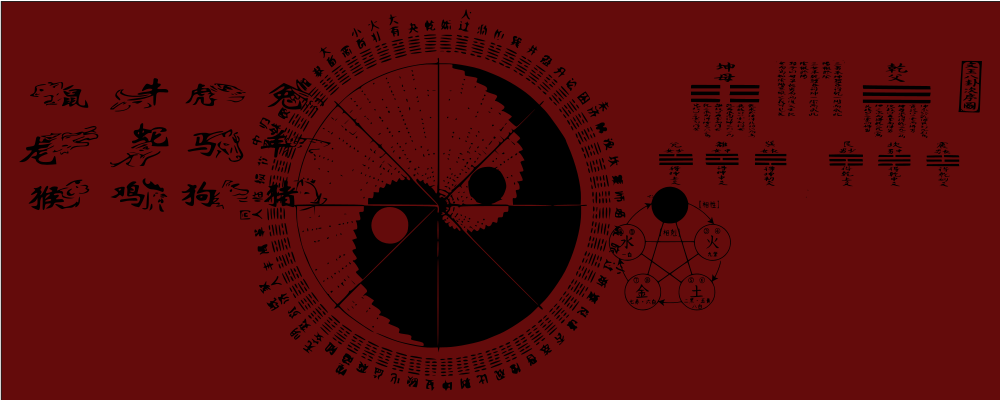

# 果赖算命阁 (Master Guo Lai's Fortune Hall)



## 🔮 Overview

Master Guo Lai's Fortune Hall is an AI-powered Chinese fortune telling application that combines traditional divination methods with modern RAG (Retrieval Augmented Generation) technology. The system draws wisdom from classical Chinese divination texts to provide authentic fortune telling experiences.

### Key Features

- **Multiple Divination Methods**:
  - 🀄 BaZi (八字) / Four Pillars of Destiny
  - 🌟 Zi Wei Dou Shu (紫微斗数) / Purple Star Astrology
  - 🧩 Qi Men Dun Jia (奇門遁甲) / Strange Gates Escaping Techniques
  - 🏮 I Ching (易经) / Book of Changes
  - 🐲 Yearly Forecasts based on Chinese Zodiac

- **Advanced RAG Technology**:
  - Vector database storing classical Chinese divination texts
  - Context-aware retrieval system
  - Specialized prompts for each divination method

- **User-Friendly Interface**:
  - Intuitive Streamlit-based frontend
  - Chat-based interaction
  - Birth date input for personalized readings
  - Chinese zodiac selection

## 📋 Technical Details

### Architecture

This application uses a modern tech stack:

- **Backend**:
  - FastAPI for the REST API
  - LangChain for RAG implementation
  - ChromaDB for vector storage
  - Google Gemini Pro for generation

- **Frontend**:
  - Streamlit for the user interface
  - Responsive design with traditional Chinese aesthetics

### RAG Implementation

The application uses Retrieval Augmented Generation to provide accurate and contextually relevant fortune telling:

1. Classical Chinese divination texts are loaded, split, and stored in a vector database
2. User queries are contextualized based on the divination method
3. Relevant passages from classical texts are retrieved
4. The LLM generates authentic responses incorporating traditional wisdom

### Data Sources

The system incorporates knowledge from classical Chinese divination texts:

- 《三命通会》 (San Ming Tong Hui)
- 《渊海子平》 (Yuan Hai Zi Ping)
- 《滴天髓》 (Di Tian Sui)
- 《子平真诠》 (Zi Ping Zhen Quan)
- 《太乙神数》 (Tai Yi Shen Shu)

## 🚀 Getting Started

### Prerequisites

- Python 3.10+
- Docker and Docker Compose (recommended)

### Installation

1. Clone this repository:
   ```bash
   git clone https://github.com/yourusername/master-shi-tai-fortune-hall.git
   cd master-shi-tai-fortune-hall
   ```

2. Run the setup script:
   ```bash
   bash setup_fortune_teller.sh
   ```

3. Add fortune telling books to the `fortune_books` directory (PDFs of the classical texts)

4. Load the books into the system:
   ```bash
   python fortune_setup.py
   ```

5. Start the application:
   ```bash
   docker-compose up
   ```

6. Visit `http://localhost:8501` in your browser

### Manual Setup

If you prefer to run without Docker:

1. Install backend requirements:
   ```bash
   cd api
   pip install -r requirements.txt
   uvicorn fortune_main:app --reload
   ```

2. In another terminal, install and run the frontend:
   ```bash
   cd app
   pip install -r requirements.txt
   streamlit run fortune_app.py
   ```

## 📝 Usage Examples

- **BaZi Analysis**: Enter your birth date and time to receive a Four Pillars of Destiny analysis
- **General Fortune**: Ask questions about life, career, relationships, or any concern
- **Yearly Forecast**: Select your Chinese Zodiac sign to get predictions for the current year

## 🤝 Contributing

Contributions are welcome! Please feel free to submit a Pull Request.

## 📄 License

This project is licensed under the MIT License - see the LICENSE file for details.

## 🙏 Acknowledgments

- This project builds upon [the original RAG Chatbot project](link-to-original)
- Special thanks to the authors of the classical Chinese divination texts
- All divination results are for entertainment purposes only